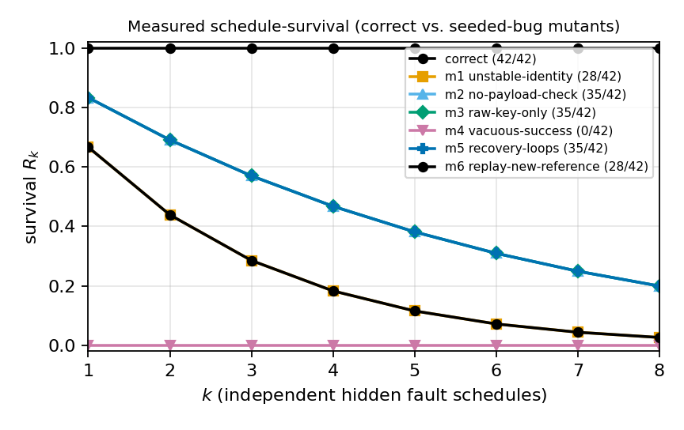
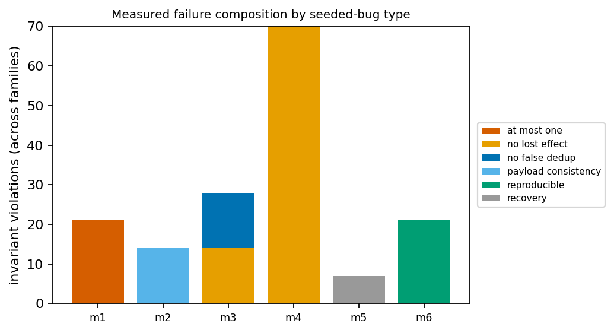

# T4: Can LLMs Generate Retry-Safe Payment Services?

**A deterministic fault-injection benchmark for the retry-safety of generated payment services.**

T4 asks a narrow but load-bearing question: when a language model writes a
payment-adjacent service, does the code stay correct when the world misbehaves —
when the process crashes right after the money moves, when the provider's
acknowledgement is dropped, when a call times out with an unknown outcome, when
the same request is delivered twice? These are exactly the conditions under
which a naive implementation double-charges a customer or silently loses an
effect, and exactly the conditions ordinary unit tests never exercise.

## What it is

T4 is a **deterministic-simulation (DST) fault-injection kernel** plus a set of
task families. Each candidate service runs single-process against injected
`Store` / `Provider` / `Clock` / `Rand` interfaces — it never touches the real
clock, real randomness, real threads, real networks, or a real payment rail.
Execution is driven one operation at a time by a serializable **schedule**, so
every failing run is reproducible and can be shrunk (delta-debugged) to a short
witness. Scoring is done by an **independent oracle** that reconstructs financial
truth from the provider effects log — not from whatever the candidate claimed
about itself.

## Status and scope (read this first)

This artifact is an **honest slice**, not a finished LLM study:

- **Shipped and tested:** the harness, **7 Tier-1 task families**
  (`capture`, `refund`, `outbox`, `consumer`, `ledger`, `saga`,
  `reconciliation`), each with **1 correct reference + 5 seeded-bug mutants** and
  ~10 fault schedules (public + hidden), a **validated shared oracle**, and a
  **measured pilot** over all shipped candidates.
- **The pilot's subjects are the shipped references and mutants, not model
  output.** Its job is to prove the measurement apparatus is sound: the correct
  reference survives every hidden schedule, and every seeded bug is caught by its
  intended invariant.
- **Not yet done — and this is the point of the repo:** evaluating actual LLMs
  across the four generation conditions. That is the documented, reproducible
  **next step** (see `docs/DEVELOPMENT_ORDER.md` and `CODING_AGENT_PROMPTS.md`),
  not a claim made here.

The Tier-1 families deliberately share one mechanism (reserve-then-effect), so
the cross-family view is uniform by design; genuine difficulty scaling is future
work (Tiers 2-3).

## Quickstart

Requires Go 1.24 and Python 3 with `matplotlib` + `numpy` (or use the
`Dockerfile`).

```sh
make smoke            # build everything + fast harness tests (a few seconds)
make reproduce-small  # full test suite + pilot + regenerate figures/metrics
```

`make reproduce-small` runs the Go test suite, executes the pilot
(`go run ./cmd/t4run` → `results/pilot_results.json`), and regenerates the
figures and metrics (`python3 analysis/make_figures.py`). See
[Reproducibility and determinism](#reproducibility-and-determinism) for exactly
what is reproducible at which granularity.

Only the figure step needs Python. If `make figures` fails on a missing
`matplotlib` or `numpy`, install them into a local virtualenv and point the
Makefile at it:

```sh
python3 -m venv .venv && .venv/bin/pip install matplotlib numpy
make figures PYTHON=.venv/bin/python          # or: make reproduce-small PYTHON=.venv/bin/python
```

`.venv/` is gitignored. The `Dockerfile` ships a pinned environment with the
plotting stack already installed and needs none of this.

## Repository layout

```
t4-benchmark/
├── harness/                 # the deterministic-simulation kernel + shared oracle
│   ├── harness.go           #   scheduler, injected Store/Provider/Clock/Rand, rail profiles
│   ├── oracle.go            #   the six invariants + CheckFinancial + Spec
│   ├── result.go            #   Result record + survival R_k
│   └── shrink.go            #   delta-debugging trace shrinker
├── tasks/                   # 7 task families (capture is the canonical template)
│   └── <family>/            #   <family>.go (Correct + M1..M5), cases.go, run.go, *_test.go
├── cmd/t4run/               # the pilot runner -> results/pilot_results.json
├── analysis/
│   ├── make_figures.py      # raw results -> figures + metrics_summary.json + metrics.csv + paper_data.tex
│   └── figures/             # committed figures (survival.png, failure_composition.png)
├── results/                 # committed reproducible artifacts (pilot records + metrics)
├── task-schema/             # JSON Schemas: task manifest, fault schedule, result record
├── generation/              # the 4 generation-condition prompts + wiring guide
├── docs/                    # FAMILY_AUTHORING_GUIDE.md, DEVELOPMENT_ORDER.md
├── CODING_AGENT_PROMPTS.md  # copy-paste prompts to take the repo to a full paper
└── ARTIFACT_EVALUATION.md   # for IEEE/ACM artifact reviewers
```

## The six invariants

The oracle (`harness.CheckFinancial`) scores every run against the same six
financial-safety invariants, reconstructed from the independent observation:

| Invariant | Meaning |
|-----------|---------|
| `at_most_one` | No duplicate external effect; no identity charged more than once. |
| `no_lost_effect` | A valid request that stabilized actually produced its required effect (no vacuous success). |
| `no_false_dedup` | Distinct valid identities are not collapsed into one effect. |
| `payload_consistency` | Reusing an identity with a *different* payload is rejected with `CONFLICT` and produces no extra effect. |
| `reproducible` | A completed operation reports a stable reference consistent with the effect log. |
| `recovery` | After faults stop, the service reaches a terminal, consistent state within a bounded number of steps (no `IN_PROGRESS`-forever). |

## Rail-profile assumption

Whether the reserve-then-effect pattern is even *safe* depends on the payment
rail's deduplication semantics, so the benchmark states its assumption
explicitly. The shipped Tier-1 families assume the **Queryable** profile: the
provider does not auto-deduplicate, but a service can reconcile an unknown
outcome by asking the provider whether an effect already exists
(`Provider.Query`). The kernel also models `StrongIdempotency` and a `WeakRail`
(no native dedup, no reliable query) on which a naive re-charge necessarily
double-charges; the weak-rail impossibility case is future work (see
`CODING_AGENT_PROMPTS.md`, P4).

## How scoring works

- **Independent observer + oracle.** The oracle never reads the candidate's
  internal status. It reconstructs the outcome from the provider effects log, the
  durable store, and the observable responses, and checks the six invariants
  against a hand-authored per-schedule `harness.Spec`. This keeps scoring
  independent of the implementation under test.
- **Survival `R_k`, not `pass@k`.** Reliability is reported as survival
  `R_k = C(m,k)/C(n,k)`: the probability that a candidate which passed `m` of `n`
  hidden schedules survives `k` schedules sampled without replacement. This does
  not assume the schedules are independent (a `pass^k` extrapolation would).

## Measured pilot results

All numbers below are measured, deterministic harness output over the shipped
references and mutants — **no synthetic data, no LLM output**. Source:
`results/metrics_summary.json` (regenerate with `make reproduce-small`).

| Metric | Value |
|--------|-------|
| Result records | 490 |
| Families × candidates × schedules | 7 × 7 × 10 |
| Compile rate | 1.00 |
| Functional pass (no-fault "happy" schedule) | 0.857 (42/49) |
| Unconditional safety (all runs) | 0.70 (343/490) |
| Safety \| functional (hidden schedules) | 0.806 (203/252) |

Hidden-schedule survival by candidate type (42 hidden schedules per type):

| Candidate | Survives 1 hidden (`R₁`) | Survives 8 hidden (`R₈`) |
|-----------|:---:|:---:|
| correct reference | **1.000** | **1.000** |
| m1 unstable-identity | 0.667 | 0.026 |
| m2 no-payload-check | 0.833 | 0.199 |
| m3 raw-key-only | 0.833 | 0.199 |
| m4 vacuous-success | 0.000 | 0.000 |
| m5 recovery-loops | 0.833 | 0.199 |

The **correct reference survives all 42 hidden schedules** (`R_k = 1.0` for
every `k`), while every mutant's survival decays toward 0 as more independent
hidden schedules are drawn — the reliability separation the benchmark is built
to measure. Each seeded bug is detected via its intended invariant (below),
which is the oracle-validity result.

The mutants are **single-fault by construction**: each trips exactly the one
invariant it was seeded to break, so the per-invariant failure counts attribute
cleanly to a cause. The single exception is `m3 raw-key-only`, which also trips
`no_lost_effect` — collapsing two distinct identities into one effect genuinely
loses an effect as well as collapsing identities, so both violations are real
consequences of the same bug rather than double-counting.





## Adding a task family

Every family is a Go package under `tasks/<family>/` that plugs into the shared
kernel; `tasks/capture/` is the canonical template. The full contract —
kernel API, event vocabulary, required files, and the hard rules (injected `Env`
only, no globals, explicit rail profile) — is in
[`docs/FAMILY_AUTHORING_GUIDE.md`](docs/FAMILY_AUTHORING_GUIDE.md). Do **not**
write your own oracle; author a `harness.Spec` per schedule and reuse
`harness.CheckFinancial`.

## Plugging in an LLM

The four generation conditions (zero-shot, retrieval, agentic, domain-guided)
and the exact recipe for wiring model output back in as a new `Factory` are in
[`generation/`](generation/README.md). In short: a candidate is any
implementation of a family's `Service` interface; save it into the family
package, bind it with `TaskFor`, and score it with the existing oracle. Building
the automated generation runner with full config logging is P5 in
`CODING_AGENT_PROMPTS.md`.

## Reproducibility and determinism

Exactly one candidate goroutine is ever runnable at a time; every injected
operation parks the caller until the scheduler releases it, so Go's scheduler
cannot introduce nondeterminism. The effects ledger is an ordered slice,
randomness is a seeded source, and logical time is a monotonic counter — nothing
reads the wall clock. Consequently a given `(candidate, schedule, seed)` produces
an identical trace and observation on every run; this is asserted by the
per-family `TestDeterminism` (`make test-determinism`).

That determinism propagates to the committed artifacts, but not uniformly — the
honest statement is per artifact class:

| Artifact | Guarantee |
|----------|-----------|
| `results/pilot_results.json`, `results/metrics.csv`, `results/metrics_summary.json`, `analysis/figures/paper_data.tex` | **Byte-for-byte identical** on re-run with the same toolchain. |
| `analysis/figures/*.png` | **Pixel-for-pixel identical** — every rendered pixel matches — but **not byte-identical across platforms.** |

The PNG caveat is a property of the encoder, not of the benchmark: matplotlib
stamps its version into a `tEXt` chunk, and libpng/zlib builds differ in
compression details between platforms (a macOS run and a Linux run of the same
matplotlib produce the same image in a different container). Verify figures by
comparing decoded pixels rather than file hashes. For a byte-stable image, build
the `Dockerfile`, which pins the toolchain and the plotting stack.

Everything that carries a *number* — the raw records, the metrics, and the
pgfplots coordinates the paper's figures are drawn from — is in the byte-for-byte
class, so no measured value can drift unnoticed.

## Responsible use

T4 is a **research benchmark**. The payment rail is a mock in-process effects
log; all merchants, identities, and amounts are **synthetic**. Nothing here
connects to a real payment processor, and the correct references are teaching
artifacts, not production-hardened payment code. Do not deploy any candidate
against real funds.

## License

Apache License 2.0 — see [`LICENSE`](LICENSE). If you use T4, please cite it
using [`CITATION.cff`](CITATION.cff). Authorship is withheld for double-blind
review.
